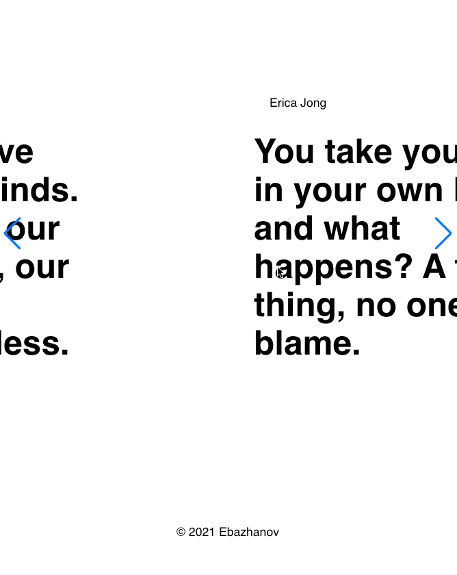
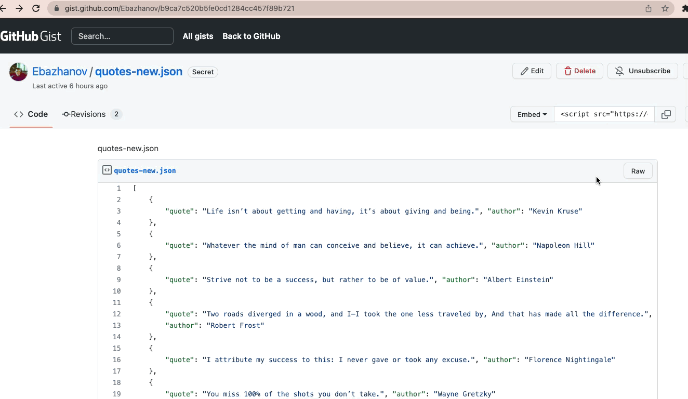

An example how to fetch data from your own Gist
---

- [x] Using Gist to store mock data [my example](https://gist.github.com/Ebazhanov/b9ca7c520b5fe0cd1284cc457f89b721)
- [x] Add Slider to show it in nice view [Docs](https://swiperjs.com/demos#default)

------

#### Usage how to get mock json path from Gist:

